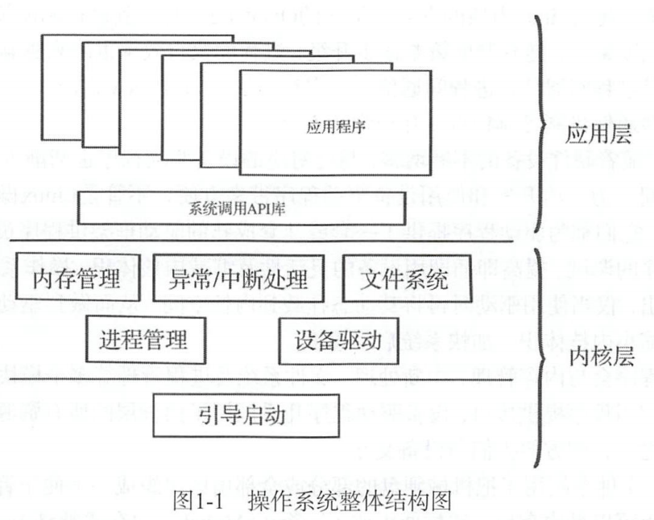
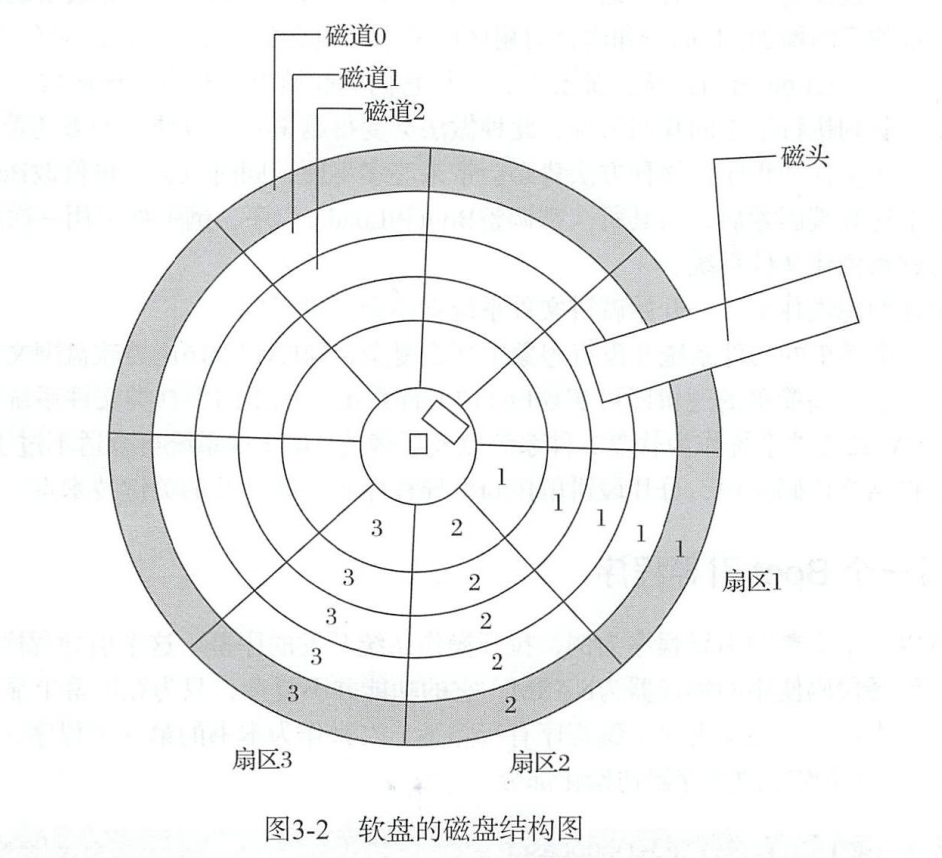
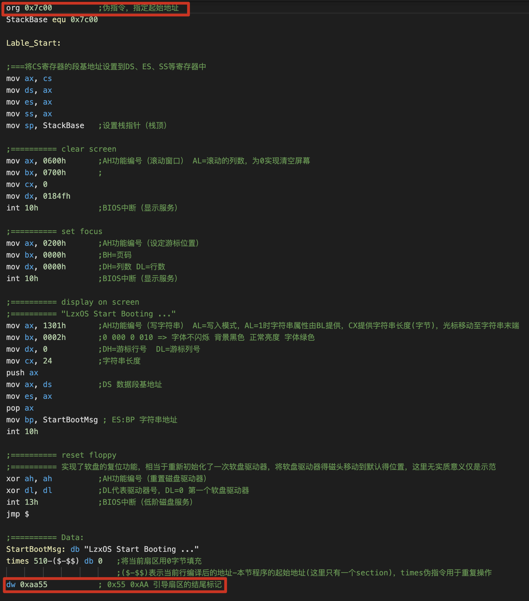
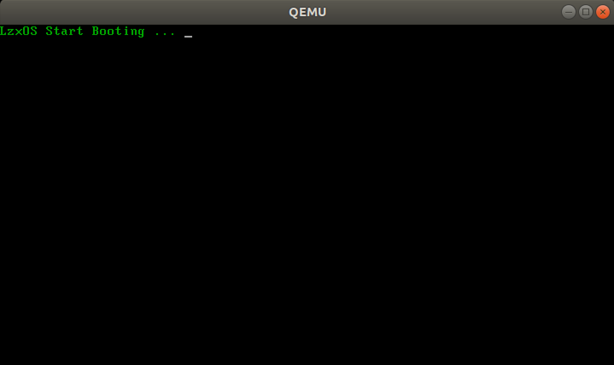
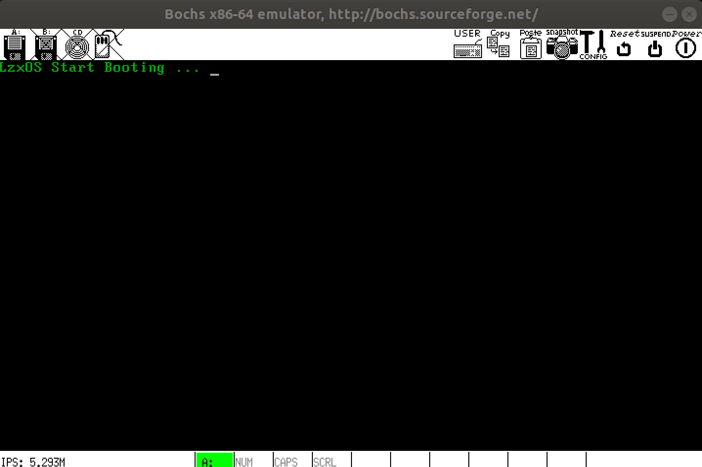

# LzxOS
> 《一个64位操作系统的设计与实现》 学习记录及代码
>
> 这个README.MD就当是记录过程了
>
> 目录生成：https://ecotrust-canada.github.io/markdown-toc/

- [LzxOS](#lzxos)
- [第一章 操作系统概述](#----------)
- [第二章 虚拟机及开发系统平台介绍](#----------------)
- [第三章 BootLoader引导启动程序](#----bootloader------)
  * [3.1 Boot引导程序](#31-boot----)
    + [3.1.1 Boot引导原理](#311-boot----)
    + [3.1.2 写一个Boot引导程序](#312----boot----)
    + [3.1.4 在Bochs(QEMU)上运行Boot](#314--bochs-qemu----boot)
      - [QEMU运行](#qemu--)
      - [Bochs运行](#bochs--)

# 第一章 操作系统概述

操作系统的组成结构如下图，分为内核层与应用层。内核层主要负责控制硬件设备、分配系统资源、为应用层提供健全的接口支持、保证应用程序稳定运行、执行流调度等等。而应用层则主要负责人机交互。



- 引导启动

  是指，计算机从BIOS上电自检后到跳转至内核程序执行前这一期间执行的一段或几段程序 这些程序主要用于检测计算机硬件，并配置内核运行时所需的参数 然后再把检测信息和参数提交给内核解析，内核会在解析数据的同时对自身进行配置。引导启动程序曾经分为两部分，Boot和Loader，现在通常合二为一，统称为BootLoader

- 内存管理

  主要作用是有效管理物理内存

- 异常/中断处理

- 进程管理

- 设备驱动

- 文件系统

  文件系统用于把机械硬盘的部分或全部扇区组织成一个便于管理的结构化单元

编写一个操作系统需要的知识：

- 硬件方面

  需要指导处理器和外围设备的电路组成，也就是处理器和外围设备是怎么连接的，进而可以知道处理器如何控制外围设备，以及如何与之通信。

  需要阅读硬件设备的芯片手册，芯片手册会详细描述芯片的硬件特性、通信方式、芯片内部的寄存器功能，以及控制寄存器的方法。但是和电子工程师关注的点不一样，作为操作系统开发人员更关注处理器如何与硬件设备通信、如何控制它们的寄存器状态。

  所以在硬件方面， 掌握硬件电路、处理器和外围设备的芯片手册即可。其中，处理器芯片手册会介绍如何初始化处理器 如何切换处理器工作模式等一系列操作处理器的信息与方法，这些知识为操作系统运行提供技术指导 硬件芯片手册会对设备上的所有寄存器功能进行描述，我们根据这些寄存器功能方可编写出驱动程序。

- 软件方面

  汇编语言和C语言，还有数据结构。

# 第二章 虚拟机及开发系统平台介绍

开发和编译环境书里用的CentOS 6，我打算用ubuntu。虚拟运行环境书里用的Bochs，我可能试试也用用QEMU。

汇编语言的书写格式大体分两种，一种是AT&T汇编语言格式，一种是Intel汇编语言格式。AT&T的格式相对复杂，Intel格式相对简介。

# 第三章 BootLoader引导启动程序

## 3.1 Boot引导程序

### 3.1.1 Boot引导原理

BIOS自检结束后会根据启动选项设置去选择启动设备。比如如果是软盘启动的话，就去检测第0磁头第0磁道第1个扇区，是否以数值Ox55 Oxaa两字节作为结尾如果是，那么BIOS就认为这个扇区是 Boot Sector （引导扇区），进而把此扇区的数据复制到物理内存地址0x7c00处，随后将处理器的执行权移交给这段程序（跳转至0x7C00地址处执行



因为这个扇区只有512B，所以只能装的下一个boot程序，由boot程序将Loader程序装到内存中，再由Loader程序装载内核。这个过程也可以看作是硬件设备向软件设备移交控制权。

### 3.1.2 写一个Boot引导程序

通过BIOS的中断服务，实现了往屏幕显示字符串的功能：

需要注意开头的`org 0x7c00`起始地址，因为BIOS会将这段程序装载到物理内存的0x7c00地址，如果不指定这个起始地址的话可能会导致寻址错误。而末尾的最后两个字节`0x55 0xAA`则表明这是一个引导扇区

> BIOS中断向量表：https://blog.csdn.net/piaopiaopiaopiaopiao/article/details/9735633
>
> 通过BIOS中断来实现各种功能



### 3.1.4 在Bochs(QEMU)上运行Boot

#### QEMU运行

原书用的bochs，一开我在ubuntu18上装最新版的bochs有问题没解决，所以用了qemu

```
sudo apt-get install qemu
```

编译boot.asm

```
nasm ./boot.asm -o boot.bin
```

将二进制文件写入软盘映像

```
dd if=boot.bin of=./boot.img bs=512 count=1 conv=notrunc
```

qemu启动脚本：

```shell
# boot.sh
qemu-system-x86_64 \
 -boot a \ #使用
   -fda $1 \ #挂载$1到第一个软盘
   -m 2048 
```

Run:

```
./boot.sh ./boot.img
```



> 鼠标点进去QEMU窗口后会锁定出不来，我是mac上开的vmware ubuntu，直接Ctrl+空格的话是鼠标回到mac主机，要从QEMU回到ubuntu虚拟机的话，得按ctrl+option+空格

#### Bochs运行

后来把ubuntu18的apt源从清华源换成了阿里源，成功装好bochs

bochs的编译configure：

```
./configure --with-x11 --with-wx --enable-debugger --enable-disasm --enable-all-optimizations --enable-readline --enable-long-phy-address --enable-ltdl-install --enable-idle-hack --enable-plugins --enable-a20-pin --enable-x86-64 --enable-smp --enable-cpu-level=6 --enable-large-ramfile --enable-repeat-speedups --enable-fast-function-calls  --enable-handlers-chaining  --enable-trace-linking --enable-configurable-msrs --enable-show-ips --enable-cpp --enable-debugger-gui --enable-iodebug --enable-logging --enable-assert-checks --enable-fpu --enable-vmx=2 --enable-svm --enable-3dnow --enable-alignment-check  --enable-monitor-mwait --enable-avx  --enable-evex --enable-x86-debugger --enable-pci --enable-usb --enable-voodoo
```

运行bochs的配置文件bochsrc：

```
# configuration file generated by Bochs
plugin_ctrl: unmapped=1, biosdev=1, speaker=1, extfpuirq=1, parallel=1, serial=1, iodebug=1
config_interface: textconfig
display_library: x
#memory: host=2048, guest=2048
romimage: file="/usr/local/share/bochs/BIOS-bochs-latest"
vgaromimage: file="/usr/local/share/bochs/VGABIOS-lgpl-latest"
boot: floppy
floppy_bootsig_check: disabled=0
floppya: type=1_44, 1_44="boot.img", status=inserted, write_protected=0
# no floppyb
ata0: enabled=1, ioaddr1=0x1f0, ioaddr2=0x3f0, irq=14
ata0-master: type=none
ata0-slave: type=none
ata1: enabled=1, ioaddr1=0x170, ioaddr2=0x370, irq=15
ata1-master: type=none
ata1-slave: type=none
ata2: enabled=0
ata3: enabled=0
pci: enabled=1, chipset=i440fx
vga: extension=vbe, update_freq=5

cpu: count=1:1:1, ips=4000000, quantum=16, model=corei7_haswell_4770, reset_on_triple_fault=1, cpuid_limit_winnt=0, ignore_bad_msrs=1, mwait_is_nop=0, msrs="msrs.def"

cpuid: x86_64=1,level=6, mmx=1, sep=1, simd=avx512, aes=1, movbe=1, xsave=1,apic=x2apic,sha=1,movbe=1,adx=1,xsaveopt=1,avx_f16c=1,avx_fma=1,bmi=bmi2,1g_pages=1,pcid=1,fsgsbase=1,smep=1,smap=1,mwait=1,vmx=1
cpuid: family=6, model=0x1a, stepping=5, vendor_string="GenuineIntel", brand_string="Intel(R) Core(TM) i7-4770 CPU (Haswell)"

print_timestamps: enabled=0
debugger_log: -
magic_break: enabled=0
port_e9_hack: enabled=0
private_colormap: enabled=0
clock: sync=none, time0=local, rtc_sync=0
# no cmosimage
# no loader
log: -
logprefix: %t%e%d
debug: action=ignore
info: action=report
error: action=report
panic: action=ask
keyboard: type=mf, serial_delay=250, paste_delay=100000, user_shortcut=none
mouse: type=ps2, enabled=0, toggle=ctrl+mbutton
speaker: enabled=1, mode=system
parport1: enabled=1, file=none
parport2: enabled=0
com1: enabled=1, mode=null
com2: enabled=0
com3: enabled=0
com4: enabled=0

megs: 2048
```

bochs运行`bochs -f ./bochsrc`：



